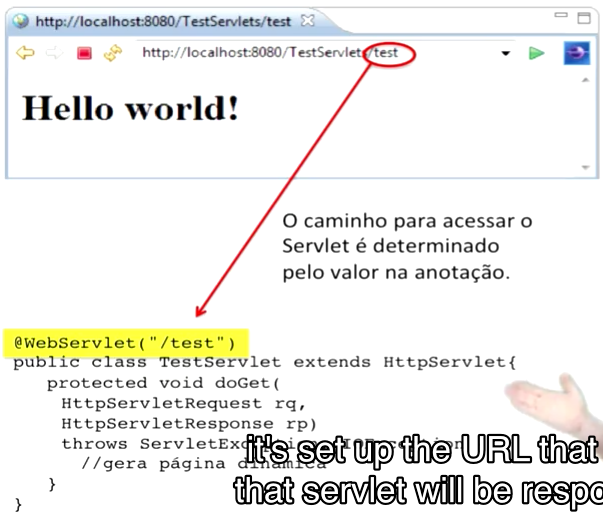

[Back](../index.md)

# 1.1.3 Criando Java Servlets >> Creating Java Servlets 8m

[][]

## 1) set up the URL

24

00: 01: 41,290 --> 00: 01: 46,216

it's set up the URL that goes,

that servlet will be responding.

## 2) extends HttpServlet

28

00: 02: 04,157 --> 00: 02: 09,605

It is important that the servlet,

it extends the HttpServlet class

## 3) parameters get or post

32

00: 02: 26,230 --> 00: 02: 31,340

The parameters of this method,

get or post,

## 4) pass parameters by ? to servlet

59

00: 04: 23,125 --> 00: 04: 27,920

we can see for example in the case of

I pass parameter to my servlet,

## 5) output through getWriter

89

00: 06: 48,863 --> 00: 06: 52,640

the HttpServletResponse,

I'll give the getWriter,

## 6) pass jsp view

104

00: 07: 55,400 --> 00: 07: 59,686

passing the name of the resource, in case

there would be for example a jsp page,

[1) set up the URL]: 